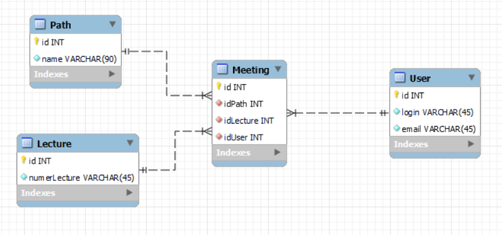
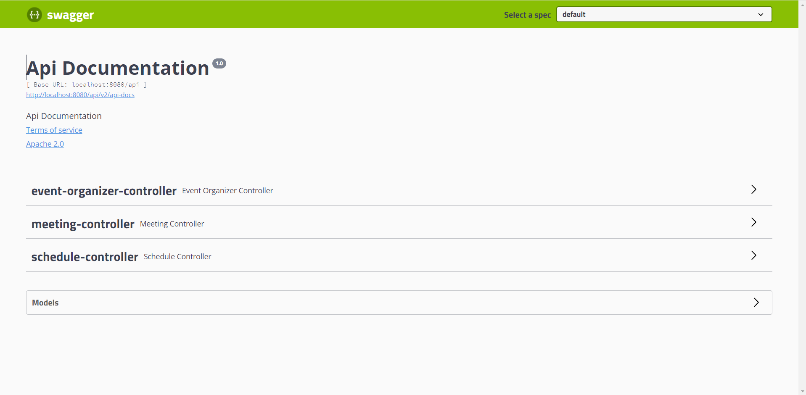
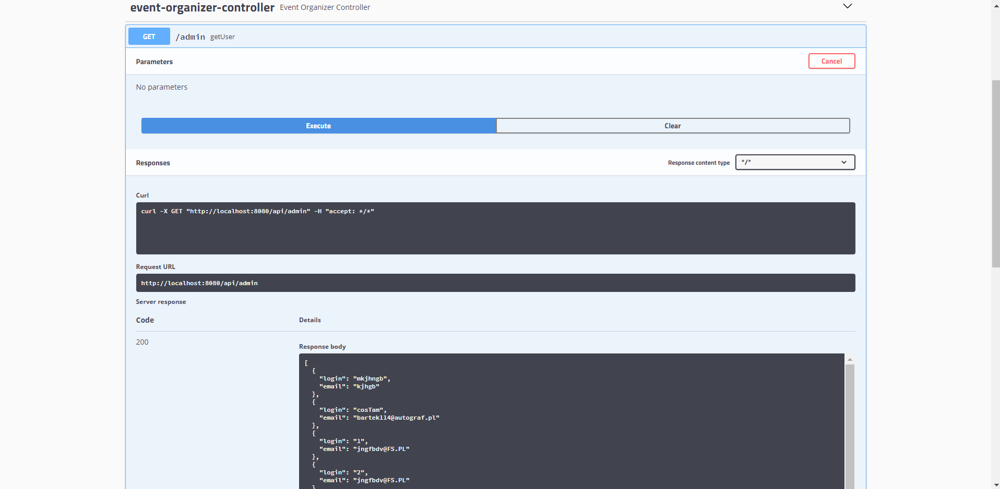

# Conference project  
> link Github: https://github.com/Bartistero/lab-wolumeny
>
> link linkedin: https://www.linkedin.com/in/bartosz-sterniczuk/

## Tabel content 
* [Generally](#Generally) 
* [How to run the project?](#How-to-run-the-project?)
* [Database schema](#Database-schema)
* [REST Example](#REST-Example)
* [Status](#status)
* [Kontakt](#contact)

## Generally 
This project was written using java 11 and the spring framework. The database engine is MySQL which you can download from [here](https://hub.docker.com/_/mysql). Application is based on third part architecture and SOLID rules.  

## How to run the project?
In the beginning, you need to connect to the database. The project uses MySQL engine (I used a docker to run it). In the main branch, you can see create.sql and insert.sql files. Please run them on your own database engine, and the database will be loaded. Next, open the IntelliJ Idea and try to run the project. I hope that you can do it ;) Nextly go to the website:
>[http://localhost:8080/api/swagger-ui.html](http://localhost:8080/api/swagger-ui.html)

## Database schema 
In the picture below, you can see the database schema.

## REST Example

If you visit the above-mentioned website you can see the following image: 

It is swagger documentation. In this place, you can test all REST endpoints. I would like to show you one example.

## Status
Project is: finished

## Kontakt
Created by [@Bartistero](https://github.com/Bartistero/) - feel free to contact me!